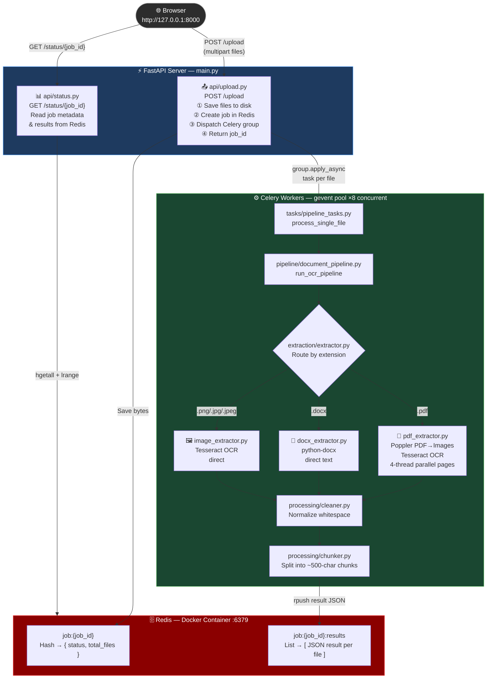
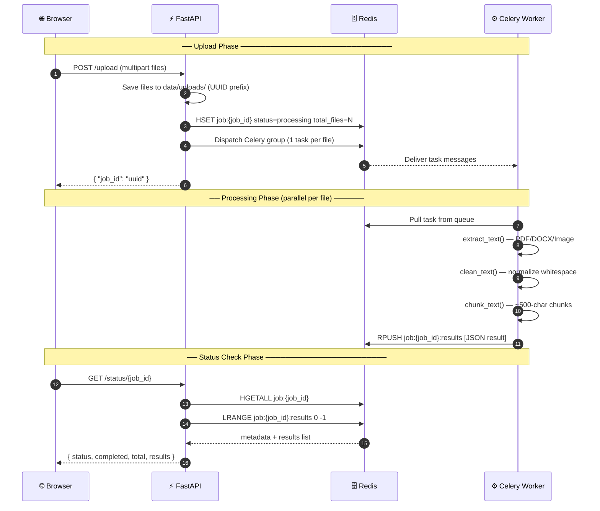

# 📄 OCR Document Processing Pipeline

A high-performance, asynchronous document OCR pipeline built with **FastAPI**, **Celery**, **Redis**, and **Tesseract**. Upload PDF, DOCX, or image files and get extracted, cleaned, and chunked text back — all processed in parallel in the background.

> **⚠️ Note for GitHub users**: The `poppler/`, `data/`, and `CUAD_v1/` directories are excluded from this repository via `.gitignore` because they contain large binary files and datasets. You must download/install them separately as described in the setup guide below.

---

## 🏗️ Tech Stack

| Layer | Technology |
|---|---|
| API Server | FastAPI |
| Task Queue | Celery (gevent pool) |
| Message Broker & Result Backend | Redis (via Docker) |
| OCR Engine | Tesseract OCR |
| PDF → Image Conversion | Poppler + pdf2image |
| DOCX Parsing | python-docx |
| Image Processing | Pillow |
| Python Version Manager | pyenv |
| Package Manager | uv |

---

## ⚙️ Prerequisites — System-Level Installations

These must be installed **before** setting up the Python environment.

### 1. Install Docker Desktop

Docker Desktop is used to run the Redis server in a container.

- Download: [https://www.docker.com/products/docker-desktop](https://www.docker.com/products/docker-desktop)
- Install and **start Docker Desktop** before proceeding.

### 2. Install pyenv (Python Version Manager)

pyenv lets you manage multiple Python versions cleanly.

**Windows** — use pyenv-win:
```powershell
# Install via PowerShell
Invoke-WebRequest -UseBasicParsing -Uri "https://raw.githubusercontent.com/pyenv-win/pyenv-win/master/pyenv-win/install-pyenv-win.ps1" -OutFile "./install-pyenv-win.ps1"; &"./install-pyenv-win.ps1"
```

> After installation, **restart your terminal** to apply the PATH changes.

### 3. Install uv (Fast Python Package Manager)

`uv` is a blazing-fast pip/virtualenv replacement.

```powershell
# Install via PowerShell
powershell -ExecutionPolicy ByPass -c "irm https://astral.sh/uv/install.ps1 | iex"
```

> After installation, **restart your terminal** to apply the PATH changes.

### 4. Install Tesseract OCR (Required — must be installed independently)

Tesseract is the OCR engine used to extract text from images and PDFs. It is **not** a Python package and must be installed at the system level.

- Download installer: [https://github.com/UB-Mannheim/tesseract/wiki](https://github.com/UB-Mannheim/tesseract/wiki)
- Run the installer and choose the default installation path:
  ```
  C:\Program Files\Tesseract-OCR\
  ```
- After installation, add Tesseract to your **System PATH**:
  - Search "Environment Variables" in Windows Start
  - Under **System Variables → Path**, add: `C:\Program Files\Tesseract-OCR`

Verify:
```powershell
tesseract --version
```

### 5. Install Poppler (Required — must be installed independently)

Poppler is used by `pdf2image` to convert PDF pages to images. It is **not** a Python package and is excluded from this repository (listed in `.gitignore`), so you must download it manually.

**Steps:**

1. Download the latest Windows build from: [https://github.com/oschwartz10612/poppler-windows/releases](https://github.com/oschwartz10612/poppler-windows/releases)
2. Extract the zip and place the folder inside the project so the path looks like:
   ```
   week1/
   └── poppler/
       └── poppler-24.08.0/
           └── Library/
               └── bin/        ← poppler binaries live here
   ```
3. The PDF extractor (`extraction/pdf_extractor.py`) will **automatically detect** this path — no extra configuration needed.

> **Alternative**: If you place Poppler somewhere else, set the environment variable to point to the `bin` folder:
> ```powershell
> $env:POPPLER_PATH = "C:\path\to\your\poppler\bin"
> ```

---

## 🚀 Setup & Run Guide (Step by Step)

### Step 1 — Start Redis via Docker Desktop

Open Docker Desktop and run the following in your terminal to pull and start a Redis container:

```powershell
docker run -d --name redis-server -p 6379:6379 redis
```

You should see the `redis-server` container running in Docker Desktop on port `6379:6379`.

> To start it again after a system restart:
> ```powershell
> docker start redis-server
> ```

---

### Step 2 — Verify pyenv and uv Installation

```powershell
pyenv --version
uv --version
```

Both commands should return version numbers without errors.

---

### Step 3 — Install Python 3.12 via pyenv

```powershell
pyenv install 3.12
```

Verify the installation:
```powershell
python --version
# Expected: Python 3.12.x
```

---

### Step 4 — Set Python 3.12 for This Project

Open the project folder in your IDE, navigate to its terminal, and run:

```powershell
pyenv local 3.12
```

This creates a `.python-version` file in the project root that locks Python 3.12 for this directory.

---

### Step 5 — Create and Activate a Virtual Environment

Before installing any dependencies, create an isolated virtual environment using `uv`:

```powershell
uv venv .venv
```

Then activate it:

```powershell
# Windows (PowerShell)
.venv\Scripts\activate
```

Your terminal prompt should now show `(.venv)` at the start, confirming the environment is active.

> You must activate the virtual environment **every time** you open a new terminal for this project.

---

### Step 6 — Install Python Dependencies

With the virtual environment active, install all dependencies declared in `pyproject.toml`:

```powershell
uv pip install .
```

> This reads from `pyproject.toml` and installs everything into your `.venv`.

---

### Step 7 — (Optional) Load the CUAD Dataset

If you want to use the **CUAD contract understanding dataset** for testing:

1. Open `load_dataset.ipynb` in VS Code or Jupyter
2. Run **only the first cell** — it will download the CUAD dataset into the `CUAD_v1/` directory

> This step is optional if you only want to test with your own PDF/DOCX files.

---

### Step 8 — Start the Celery Worker

Make sure Redis is running in Docker Desktop, then open a terminal in the project root (with `.venv` activated) and run:

```powershell
uv run celery -A core.celery_app worker --loglevel=info --pool=gevent --concurrency=8
```

You should see Celery connect to Redis and report it is ready to process tasks.

> `--pool=gevent` enables asynchronous I/O for the workers.  
> `--concurrency=8` allows up to 8 tasks to run simultaneously.

---

### Step 9 — Start the FastAPI Server

Open a **new terminal** in the project root (activate `.venv` again) and run:

```powershell
uv run fastapi dev main.py
```

The server will start at: **http://127.0.0.1:8000**

---

### Step 10 — Upload a Document

- Open your browser and go to **http://127.0.0.1:8000**
- You'll see a simple upload form — select a **PDF** or **DOCX** file and click **Upload**
- The API returns a `job_id`, e.g.:
  ```json
  { "job_id": "3f2a1b4c-..." }
  ```
- Copy this `job_id` for the next step.

---

### Step 11 — Check Job Status

Open the interactive API docs:

**http://127.0.0.1:8000/docs**

1. Expand the **GET `/status/{job_id}`** endpoint
2. Click **Try it out**
3. Paste your `job_id` into the field and click **Execute**
4. The response shows:
   ```json
   {
     "status": "completed",
     "completed": 1,
     "total": 1,
     "results": [
       {
         "file": "data/uploads/...",
         "result": {
           "clean_text": "...",
           "chunks": ["...", "..."]
         }
       }
     ]
   }
   ```

---

## 📁 Project Structure

```
week1/
├── main.py                   # FastAPI app entry point
├── pyproject.toml            # Project metadata & dependencies
├── poppler/                  # Bundled Poppler binaries (PDF→image)
├── data/
│   └── uploads/              # Uploaded files are saved here (auto-created)
│
├── api/                      # HTTP API layer
│   ├── router.py             # Combines all sub-routers
│   ├── upload.py             # POST /upload — file ingestion & job dispatch
│   └── status.py             # GET /status/{job_id} — job status polling
│
├── core/                     # Infrastructure / shared services
│   ├── celery_app.py         # Celery instance and broker config
│   └── redis_client.py       # Shared Redis client (decode_responses=True)
│
├── ingestion/
│   └── file_manager.py       # Saves uploaded bytes to data/uploads/
│
├── tasks/
│   └── pipeline_tasks.py     # Celery task: process_single_file
│
├── pipeline/
│   └── document_pipeline.py  # Orchestrates extract → clean → chunk
│
├── extraction/               # Format-specific text extractors
│   ├── extractor.py          # Router: dispatches by file extension
│   ├── pdf_extractor.py      # PDF → OCR (Poppler + Tesseract, parallel pages)
│   ├── image_extractor.py    # PNG/JPG → OCR (Tesseract)
│   └── docx_extractor.py     # DOCX → plain text (python-docx)
│
└── processing/               # Post-extraction text processing
    ├── cleaner.py            # Normalizes whitespace
    └── chunker.py            # Splits text into ~500-char chunks
```

---

## 🔄 Architecture & Workflow

### High-Level Architecture



---

### Module-by-Module Breakdown

#### `main.py` — Application Entry Point
Initializes the FastAPI app and mounts all API routers. Kept intentionally minimal.

---

#### `api/` — HTTP API Layer

| File | Purpose |
|---|---|
| `router.py` | Combines `upload_router` and `status_router` into a single `APIRouter` |
| `upload.py` | Accepts file uploads, saves them, creates a Redis job record, dispatches a Celery `group` (one task per file), returns `job_id` |
| `status.py` | Polls Redis for job metadata (`total_files`) and results list (`completed`). Derives status as `processing`, `completed`, or `not_found` |

**Key design**: Files are dispatched as a **Celery group** — all files in a single upload are processed **in parallel** across available workers.

---

#### `core/` — Infrastructure & Shared Services

| File | Purpose |
|---|---|
| `celery_app.py` | Creates the Celery instance connected to Redis as both broker and result backend. Configured with only time-limit guards (no parallelism restrictions) |
| `redis_client.py` | A single shared `redis.Redis` client instance (decode_responses=True) used by both API and tasks |

---

#### `ingestion/` — File Ingestion

| File | Purpose |
|---|---|
| `file_manager.py` | Saves raw file bytes to `data/uploads/` with a UUID-prefixed filename to prevent collisions |

---

#### `tasks/` — Celery Task Definitions

| File | Purpose |
|---|---|
| `pipeline_tasks.py` | Defines `process_single_file` Celery task. Has auto-retry (up to 3×, with exponential backoff) for any exception. Pushes result or error JSON to `job:{job_id}:results` list in Redis |

---

#### `pipeline/` — Pipeline Orchestrator

| File | Purpose |
|---|---|
| `document_pipeline.py` | `run_ocr_pipeline(filepath)` — calls extract → clean → chunk in sequence and returns `{ clean_text, chunks }` |

---

#### `extraction/` — Text Extractors

| File | Handles | How |
|---|---|---|
| `extractor.py` | Routing | Checks file extension, dispatches to the right extractor |
| `pdf_extractor.py` | `.pdf` | Converts PDF pages to images using **Poppler** (`pdf2image`), preprocesses each image (contrast + sharpness via Pillow), then runs **Tesseract** OCR across all pages using a 4-thread `ThreadPoolExecutor` |
| `image_extractor.py` | `.png`, `.jpg`, `.jpeg` | Opens image with Pillow, runs Tesseract directly |
| `docx_extractor.py` | `.docx` | Uses `python-docx` to extract paragraph text directly (no OCR needed for native Word files) |

---

#### `processing/` — Text Post-Processing

| File | Purpose |
|---|---|
| `cleaner.py` | Collapses all whitespace (spaces, tabs, newlines) into single spaces and strips leading/trailing whitespace |
| `chunker.py` | Splits cleaned text into sentence-boundary-aware chunks of up to **500 characters** using regex lookbehind on `.!?` |

---

### Full Request Lifecycle (Sequence)



---

## 🔧 Celery Configuration Notes

> **`worker_prefetch_multiplier` and `worker_max_tasks_per_child` have been intentionally removed.**

| Setting | Effect if set | Why removed |
|---|---|---|
| `worker_prefetch_multiplier=2` | Each worker pre-fetches 2× tasks, reducing visible concurrency for other workers | Restricts parallel throughput — removed |
| `worker_max_tasks_per_child=100` | Worker process restarts after 100 tasks (memory guard) | Causes brief downtime during restart, hurts parallelism | Removed |
| `task_time_limit=3600` | Kills task if it runs > 1 hour | Safety guard only — **kept** |
| `task_soft_time_limit=3300` | Raises `SoftTimeLimitExceeded` at 55 min | Safety guard only — **kept** |

Celery's default `worker_prefetch_multiplier=4` is used, which allows true parallel processing across all 8 gevent concurrency slots.

---

## 🌐 API Reference

### `GET /`
Returns an HTML upload form. Upload one or more files.

**Response**: HTML page

---

### `POST /upload`
Accepts one or more files (`multipart/form-data`), saves them, and queues OCR processing.

**Request**: `files` — one or more PDF/DOCX/PNG/JPG files

**Response**:
```json
{ "job_id": "3f2a1b4c-d5e6-..." }
```

---

### `GET /status/{job_id}`
Returns the processing status for a given job.

**Response**:
```json
{
  "status": "completed",
  "completed": 2,
  "total": 2,
  "results": [
    {
      "file": "data/uploads/uuid_filename.pdf",
      "result": {
        "clean_text": "Full extracted and cleaned text...",
        "chunks": ["Chunk 1 text...", "Chunk 2 text..."]
      }
    }
  ]
}
```

**Status values**:
- `processing` — still running
- `completed` — all files done
- `not_found` — invalid `job_id`

---

## ⚠️ Troubleshooting

| Problem | Solution |
|---|---|
| `tesseract is not installed or it's not in your PATH` | Install Tesseract OCR and add it to system PATH (see Prerequisites §4) |
| `Unable to get page count. Is poppler installed and in PATH?` | Poppler is bundled in `poppler/`. Check the path or set `POPPLER_PATH` env var |
| `Connection refused` on Redis | Start the Redis Docker container: `docker start redis-server` |
| Celery worker not picking up tasks | Make sure Celery is started with `-A core.celery_app` and Redis is running |
| `ModuleNotFoundError` | Run `uv pip install .` from the project root |

---

## 📝 Notes

- The `data/uploads/` directory is created automatically on first run.
- Uploaded files are stored permanently — add a cleanup routine if needed.
- For production use, consider adding authentication, rate limiting, and persistent storage.
- The `.python-version` file locks Python 3.12 for this project via pyenv.
