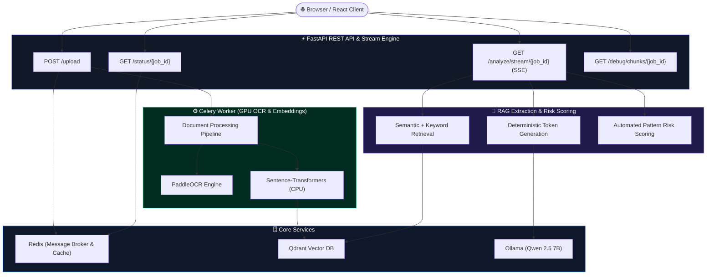
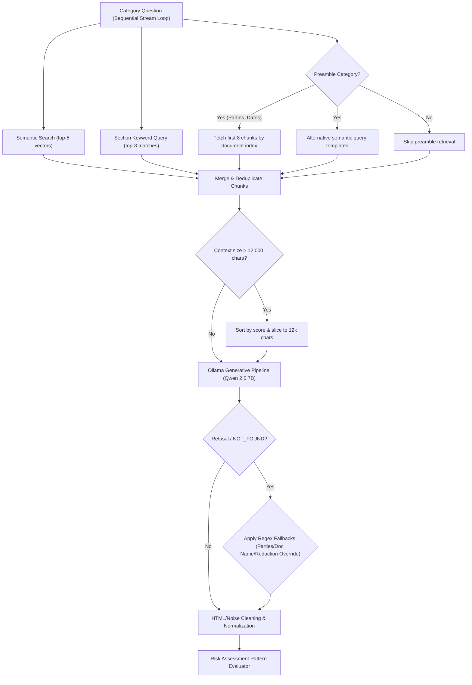

# ⚖️ ZAALIMA — Contract Intelligence & Risk Platform

An AI-powered legal contract analysis platform using **RAG (Retrieval-Augmented Generation)** and **Local LLMs** for automated clause extraction, confidence indexing, risk scoring, and real-time streaming analysis.

Upload a PDF, DOCX, or legal contract image to receive a structured compliance audit of 16 legal categories—scoring risk factors, identifying critical warning flags, and presenting results in a modern, interactive chatbot-style interface with persistent history threads.

---

## 🏗️ System Architecture

The platform combines a **FastAPI** web server, a **Celery** background worker pool (OCR/Parsing), a **Qdrant** Vector database for semantic indexing, and **Ollama** for generative compliance auditing.

### High-Level Topology



### RAG Retrieval & Fallback Flow

For each category, the RAG engine performs a hybrid retrieval pass to maximize recall before executing generative extraction.



---

## 📊 Legal Audit Categories (CUAD-Based)

The platform evaluates contracts against 16 critical risk and compliance parameters derived from the Atticus CUAD taxonomy:

| Category Group | Target Categories | Risk Focus |
|---|---|---|
| **Core Identifiers** | Document Name, Parties, Effective Date, Expiration Date | Signatory identity, duration validity, preambles |
| **Key Terms** | Governing Law, Assignment, Renewal Term | Jurisdictional exposure, transfer restrictions, auto-renewals |
| **Financial Terms** | Payment Terms, Limitation of Liability, Indemnification | Cash flow terms, maximum financial cap, indemnity exposure |
| **Covenants** | Non-Compete, Confidentiality, Non-Solicitation | Non-compete scope, NDA survival periods, poaching limits |
| **Termination** | Termination for Convenience, Termination for Cause | Notice periods, cure windows, unilateral exits |
| **Intellectual Property** | Intellectual Property Ownership | Assignment of created IP, data ownership, work-product |

---

## ⚙️ Tech Stack & Dependencies

*   **REST Server:** FastAPI (ASGI async core)
*   **Background Tasks:** Celery (Solo worker pool)
*   **Vector Engine:** Qdrant DB
*   **Generative AI:** Ollama (Qwen 2.5 7B, temperature=0.0 for zero-variance deterministic outputs)
*   **Embeddings:** Sentence-Transformers (`all-MiniLM-L6-v2` generating 384-dimensional vectors)
*   **Text Extraction:** PyMuPDF (`fitz`) native layout parsing with automated PaddleOCR PP-OCRv4 image render fallback.
*   **GPU Acceleration:** NVIDIA CUDA 12.x / cuDNN 8.9.7 acceleration for PaddleOCR.
*   **UX Interface:** Vite + React + TypeScript with glassmorphism CSS, Light/Dark theme toggle, streaming cursors, and local storage state persistence.

---

## 🚀 Setup & Execution

### 1. Initialize Infrastructure Services
Start Redis and Qdrant database containers:
```bash
# Start Redis Container (Broker)
docker run -d --name redis-server -p 6379:6379 redis

# Start Qdrant Container (Vector DB)
docker run -d --name qdrant -p 6333:6333 qdrant/qdrant
```

Ensure Ollama is installed on your host system. Pull the core legal reasoning model:
```bash
ollama pull qwen2.5:7b
```
*(Note: You do not need to run a separate command to start Ollama; the FastAPI server automatically manages and launches the Ollama server in the background if it is not running).*

### 2. Configure Environment Variables
Create a `.env` file in the root directory:
```env
REDIS_URL=redis://localhost:6379/0
QDRANT_URL=http://localhost:6333
OLLAMA_URL=http://127.0.0.1:11434/api/generate
OLLAMA_MODEL=qwen2.5:7b
EMBEDDING_DEVICE=cpu
OCR_USE_GPU=true
OCR_GPU_ID=0
```

### 3. Launch the Backend
Install python dependencies and spin up worker and API servers:
```bash
# 1. Sync virtual environment packages
uv sync

# 2. Run the Celery background worker
uv run celery -A core.celery_app worker --loglevel=info --pool=solo

# 3. Start the FastAPI REST application
uv run uvicorn main:app --reload
```

### 4. Launch the Frontend
Navigate to the frontend folder, install dependencies, and start the development server:
```bash
cd frontend
npm install
npm run build   # Optional: Build for production to be served by FastAPI
npm run dev
```

### 5. Access the Application
You can access the platform in two ways:
1. **Development Server (Hot-Reloading):** Open **http://localhost:5174** (or the port Vite provides) in your browser.
2. **Production Server:** Open **http://127.0.0.1:8000**. FastAPI will serve the optimized frontend build from the `frontend/dist` directory.

---

## 🌐 API Reference

| Endpoint | Method | Response Format | Description |
|---|---|---|---|
| `/upload` | POST | JSON | Uploads contract files, creates job IDs, and triggers parsing. |
| `/status/{job_id}` | GET | JSON | Returns active text extraction queue progress. |
| `/analyze/stream/{job_id}` | GET | SSE (text/event-stream) | Streams token chunks and category audits in real-time. |
| `/analyze/{job_id}` | GET | JSON | Retains compatibility by returning the final analysis statically. |
| `/debug/chunks/{job_id}` | GET | JSON | Inspects chunk indexing and parsed headings in the vector store. |
| `/health` | GET | JSON | Performs a readiness probe checking Redis, Qdrant, and Ollama connectivity. |

### SSE Event Stream Protocol (`/analyze/stream/{job_id}`)
The streaming API yields real-time Server-Sent Events with standard payload wrappers:
*   **`start`**: Triggered when a new category begins analysis.
    ```json
    event: message
    data: {"status": "start", "category": "Parties", "question": "Who are the parties..."}
    ```
*   **`chunk`**: Yields raw tokens directly as they are generated by the local LLM.
    ```json
    event: message
    data: {"status": "chunk", "category": "Parties", "text": "Xencor"}
    ```
*   **`done`**: Emitted once the category completes, providing cleaned textual extractions, risk score differentials, and confidence ratings.
    ```json
    event: message
    data: {"status": "done", "category": "Parties", "extracted_answer": "Xencor, Inc. and Aimmune Therapeutics, Inc.", "confidence_score": 8.5, "confidence_label": "HIGH", "risk_level": "LOW", "risk_flag": null}
    ```
*   **`final_summary`**: Concludes the event stream, emitting the final aggregated risk summary metrics.
    ```json
    event: message
    data: {"status": "final_summary", "risk_summary": {"overall_risk": "HIGH", "total_risk_score": 10, "high_risk_flags": 2, "medium_risk_flags": 0}}
    ```

---

## 🛠️ Optimizations & Enhancements

1.  **Decoupled Multi-Query Execution:** Grouped querying has been replaced with a sequential loop structure. Each legal category is audited inside its own RAG context pipeline, eliminating context window crowding and resolving false-negative `NOT_FOUND` errors.
2.  **GPU-Accelerated OCR Fallback:** Removed forced CPU execution settings. PaddleOCR now hooks directly into the host system's GPU (tested on RTX 4060) utilizing native CUDA threads, cutting scanned PDF processing times by over 80%.
3.  **Automatic Ollama Management:** FastAPI intercepts requests and checks port `11434`. If Ollama is offline, the API starts a detached Ollama background thread automatically before triggering model pre-warmups.
4.  **Persistent Thread Workspace:** Implemented localStorage-based threads saving. Analyzed audits persist across browser reloads, allowing users to instantly load, review, or delete audit histories.

---

## 🛠️ Troubleshooting

### Windows Folder Path Issues
If your project is located in a folder containing an ampersand (`&`) (e.g., `f:\DS & ML\...`), default `npm` scripts like `"dev": "vite"` will fail on Windows because `cmd.exe` misinterprets the `&` in the `.bin` executable path as a command separator. 
*Fix:* We have already updated `package.json` to bypass `.bin` shims and invoke node directly:
```json
"dev": "node node_modules/vite/bin/vite.js"
```
Ensure you do not revert this if you clone the project to a similarly named folder.
