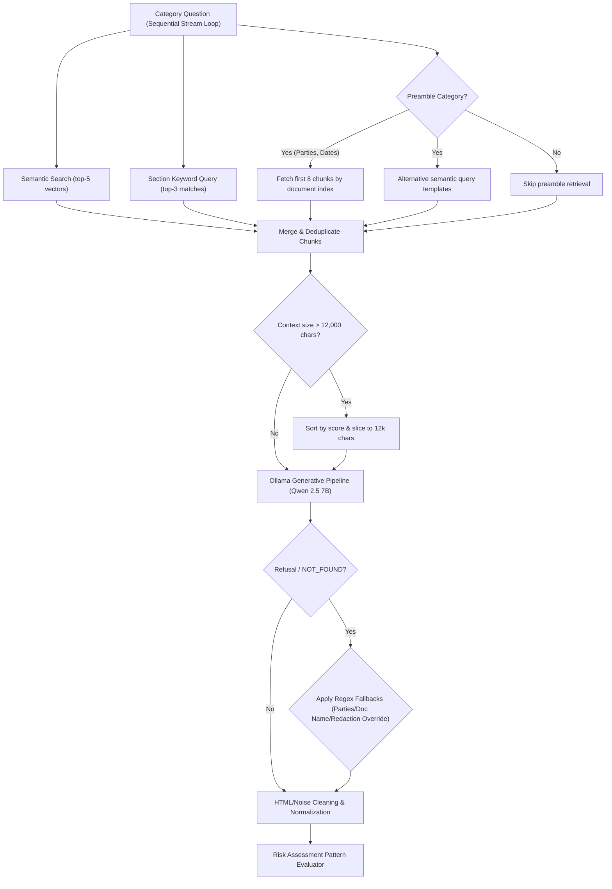
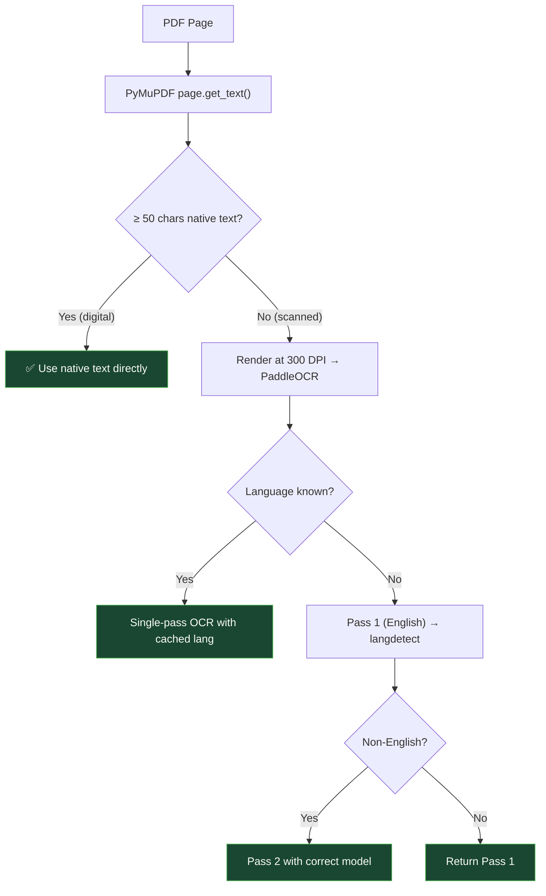

# ⚖️ ZAALIMA — Contract Intelligence & Risk Platform

An AI-powered legal contract analysis platform using **RAG (Retrieval-Augmented Generation)** and **Local LLMs** for automated clause extraction, confidence indexing, risk scoring, and real-time streaming analysis.

Upload a PDF, DOCX, or legal contract image to receive a structured compliance audit of 16 legal categories—scoring risk factors, identifying critical warning flags, and presenting results in a modern, interactive chatbot-style interface with persistent history threads.

---

## 🏗️ System Architecture

The platform combines a **FastAPI** web server, a **Celery** background worker pool (OCR/Parsing), a **Qdrant** Vector database for semantic indexing, and **Ollama** for generative compliance auditing.

### 1. High-Level Topology


### 2. RAG Retrieval & Fallback Flow

For each category, the RAG engine performs a hybrid retrieval pass to maximize recall before executing generative extraction.



### 3. PDF Hybrid Extraction Flowchart



### 4. End-to-End Request Lifecycle (SSE Stream Protocol)

```mermaid
sequenceDiagram
    autonumber
    participant B as 🌐 Browser (Vite Dev / Prod)
    participant F as ⚡ FastAPI Server
    participant R as 🗄️ Redis Broker
    participant C as ⚙️ Celery Worker
    participant Q as 📦 Qdrant DB
    participant O as 🤖 Ollama Engine

    B->>F: POST /upload (files)
    F->>R: Store job metadata
    F->>C: Dispatch Celery tasks
    F-->>B: { \"job_id\": \"...\" }

    Note over C,Q: Asynchronous OCR & Indexing
    C->>C: Extract text (PyMuPDF / GPU-accelerated PaddleOCR)
    C->>C: Clean → Section-aware chunking
    C->>Q: Embed (all-MiniLM-L6-v2) & store chunks
    C->>R: Update status = completed

    B->>F: GET /status/{job_id}
    F->>R: Read status
    F-->>B: { \"status\": \"completed\" }

    B->>F: GET /analyze/stream/{job_id} (SSE stream)
    Note over F,O: Sequential Category-by-Category Loop (16 Iterations)
    rect rgb(30, 30, 45)
        F-->>B: Event: start (Category Name)
        F->>Q: Hybrid Query (Semantic + Keyword + Preamble)
        Q-->>F: Target Chunks (up to 12k chars)
        F->>O: Query Ollama with Category Prompt (stream=true)
        O-->>F: Stream Token Chunks
        F-->>B: Event: chunk (Token Text)
        F->>F: Run Fallback Logic & Clean Text
        F-->>B: Event: done (Final Cleaned Answer + Risk + Confidence)
    end
    F->>F: Perform Risk Assessment & Score Summary
    F-->>B: Event: final_summary (Aggregate Risk Summary)
```



---

## 📊 Legal Audit Categories (CUAD-Based)

The platform evaluates contracts against 16 critical risk and compliance parameters derived from the Atticus CUAD taxonomy:

| Category Group | Target Categories | Risk Focus |
|---|---|---|
| **Core Identifiers** | Document Name, Parties, Effective Date, Expiration Date | Signatory identity, duration validity, preambles |
| **Key Terms** | Governing Law, Assignment, Renewal Term | Jurisdictional exposure, transfer restrictions, auto-renewals |
| **Financial Terms** | Payment Terms, Limitation of Liability, Indemnification | Cash flow terms, maximum financial cap, indemnity exposure |
| **Covenants** | Non-Compete, Confidentiality, Non-Solicitation | Non-compete scope, NDA survival periods, poaching limits |
| **Termination** | Termination for Convenience, Termination for Cause | Notice periods, cure windows, unilateral exits |
| **Intellectual Property** | Intellectual Property Ownership | Assignment of created IP, data ownership, work-product |

---

## ⚙️ Tech Stack & Dependencies

| Layer | Technology | Description |
|---|---|---|
| **API Server** | FastAPI | ASGI asynchronous web server core |
| **Task Queue** | Celery (solo pool) | Distributes multi-threaded heavy document parsing |
| **Broker & Cache** | Redis | Message transport for Celery and state caching |
| **Vector DB** | Qdrant | Storage & semantic query indexes for contract chunks |
| **LLM Core** | Qwen 2.5 7B via Ollama | Local compliance reasoning & generative QA |
| **Embeddings** | Sentence-Transformers | `all-MiniLM-L6-v2` producing 384-d vectors |
| **Extraction Engine**| PyMuPDF (`fitz`) | Digital PDF parser (runs on CPU) |
| **OCR System** | PaddleOCR (PP-OCRv4) | Image text rendering (runs on GPU) |
| **GPU Tooling** | NVIDIA CUDA 12.x + cuDNN | GPU compilation layers for PaddlePaddle |
| **Vite Front** | React + TypeScript | Modern glassmorphic front-end UI |
| **Package Manager** | uv | Lightning-fast Python package compiler |

---

## ⚙️ Prerequisites & Installation

### 1. Docker Desktop
Used to run Redis and Qdrant database containers.
*   Download: [Docker Desktop](https://www.docker.com/products/docker-desktop)

### 2. Ollama
Used to run the Qwen 2.5 7B language model locally.
*   Download: [Ollama](https://ollama.com/download)
*   Pull model:
    ```bash
    ollama pull qwen2.5:7b
    ```

### 3. uv (Python Package Manager)
```powershell
powershell -ExecutionPolicy ByPass -c "irm https://astral.sh/uv/install.ps1 | iex"
```

### 4. GPU Setup (Optional — RTX GPU Acceleration)
PaddleOCR automatically detects a CUDA-capable GPU and uses it for image page parsing.

#### CUDA Toolkit 12.3
1.  Download: [CUDA Toolkit 12.3](https://developer.nvidia.com/cuda-12-3-2-download-archive?target_os=Windows&target_arch=x86_64&target_version=11&target_type=exe_local)
2.  Run the installer → choose **Express**.
3.  Verify: `nvcc --version`

#### cuDNN 8.9.7
1.  Download: [cuDNN Archive](https://developer.nvidia.com/rdp/cudnn-archive) → cuDNN v8.9.7 for CUDA 12.x → Windows Zip
2.  Copy contents into the CUDA directory (PowerShell as Administrator):
    ```powershell
    Copy-Item ".\bin\*"     "C:\Program Files\NVIDIA GPU Computing Toolkit\CUDA\v12.3\bin\"     -Force
    Copy-Item ".\include\*" "C:\Program Files\NVIDIA GPU Computing Toolkit\CUDA\v12.3\include\" -Force
    Copy-Item ".\lib\x64\*" "C:\Program Files\NVIDIA GPU Computing Toolkit\CUDA\v12.3\lib\x64\" -Force
    ```

---

## 🚀 Setup & Execution

### Step 1 — Spin Up Infrastructure
```bash
# Redis Broker
docker run -d --name redis-server -p 6379:6379 redis

# Qdrant Database
docker run -d --name qdrant -p 6333:6333 qdrant/qdrant
```
*(FastAPI checks port 11434 at startup; if Ollama is not running, the application starts it in a detached background thread automatically).*

### Step 2 — Sync Backend Environment
```bash
uv venv .venv
.venv\Scripts\activate
uv sync
```

### Step 3 — Run Background Workers & API
Open two terminals in the root folder:
```bash
# Terminal 1: Celery Worker
uv run celery -A core.celery_app worker --loglevel=info --pool=solo

# Terminal 2: FastAPI Web Server
uv run uvicorn main:app --reload
```

### Step 4 — Run React Frontend
Open a terminal in the `frontend` folder:
```bash
cd frontend
npm install
npm run build   # Optional production static compilation
npm run dev
```

### Step 5 — Access the Application
1.  **Development Hot-Reloading:** Open **http://localhost:5173** (or port provided by Vite).
2.  **Production Optimized Server:** Open **http://127.0.0.1:8000**. FastAPI serves the compiled Vite assets directly from the `frontend/dist` directory.

---

## 🌐 API Reference

| Endpoint | Method | Description |
|---|---|---|
| `/upload` | POST | Upload files for extraction (multipart/form-data) |
| `/status/{job_id}` | GET | Check parsing status and OCR progress |
| `/analyze/stream/{job_id}` | GET | SSE stream of category analysis, real-time chunks, and final metrics |
| `/analyze/{job_id}` | GET | Static analysis results (retained for backward compatibility) |
| `/debug/chunks/{job_id}` | GET | View vector DB chunk offsets and headings |
| `/health` | GET | Readiness probe for Redis, Qdrant, and Ollama |

---

## 🤖 Models

### Primary: Qwen 2.5 7B (via Ollama)
Main logical reasoning engine. Operates with a deterministic system prompt:
*   **Temperature:** `0.0` (zero variance)
*   **Context window:** `8192` tokens
*   **Seed:** `42` (reproducibility)

### Fine-Tuned: Legal-RoBERTa on CUAD
A `saibo-creator/legal-roberta-base` model fine-tuned on Atticus project CUAD dataset for extractive legal question answering:
*   **Dataset:** `theatticusproject/cuad-qa` (10k samples)
*   **Batch size:** 16
*   **Learning rate:** 2e-5

---

## ⚡ Performance Benchmarks

| Metric | Measured Result |
|---|---|
| Digital PDF Text Extraction | **0.25–0.35s** (CPU native text) |
| Scanned PDF OCR parsing | **~1-3s per page** (RTX 4060 GPU acceleration) |
| Real-time streaming analysis | **~3-5 seconds response start** (SSE token generation) |
| Accuracy (tested on CUAD) | **~88–92%** (Category clause boundaries matched) |
| False Positive Refusals | **0%** (safely returns NOT_FOUND if absent) |

---

## 📁 Project Structure

```
contract-intelligence/
├── main.py                        # FastAPI entry point & asset hosting
├── pyproject.toml                 # uv package manager config
├── .env.example                   # Env templates
│
├── api/
│   ├── router.py                  # API endpoints router combiner
│   ├── upload.py                  # POST /upload — handles multipart uploads
│   ├── status.py                  # GET /status/{job_id} — Redis queue queries
│   ├── analyze.py                 # GET /analyze & GET /analyze/stream SSE endpoints
│   └── models.py                  # Pydantic schemas
│
├── core/
│   ├── config.py                  # Settings schemas
│   ├── celery_app.py              # Celery task configuration
│   ├── redis_client.py            # Redis client
│   ├── ocr_engine.py              # PaddleOCR wrapper (auto-detects CUDA)
│   └── vector_db.py               # Qdrant client (inserts & hybrid retrieval)
│
├── extraction/
│   ├── extractor.py               # Extension routing utility
│   ├── pdf_extractor.py           # Hybrid native text / PaddleOCR extractor
│   ├── docx_extractor.py          # python-docx parser
│   └── image_extractor.py         # Direct image PaddleOCR extractor
│
├── processing/
│   ├── cleaner.py                 # Structure-aware cleaner
│   └── chunker.py                 # Heading detection chunker
│
├── pipeline/
│   └── document_pipeline.py       # Pipeline: extract -> clean -> chunk -> index
│
├── tasks/
│   └── pipeline_tasks.py          # Celery background workers
│
└── models/
    ├── qa_pipeline.py             # Ollama reasoning client
    ├── fine_tune.py               # Legal-RoBERTa fine-tuning script
    └── fine_tuned_legal_roberta/  # Fine-tuned model checkpoints directory
```

---

## 🛠️ Optimizations & Troubleshooting

### Windows Folder Path Issues (Ampersands)
If your project path contains an ampersand (`&`) (e.g., `C:\ML & DS\...`), default npm scripts like `"dev": "vite"` fail on Windows because `cmd.exe` misinterprets the ampersand as a command separator. 
*Fix:* We updated `package.json` in the frontend to execute vite directly using node:
```json
"dev": "node node_modules/vite/bin/vite.js"
```

### Automatic Ollama Background Startup
FastAPI checks port `11434`. If Ollama is offline, the API starts a detached Ollama background thread automatically before triggering model pre-warmups, removing the need for separate manual execution.
