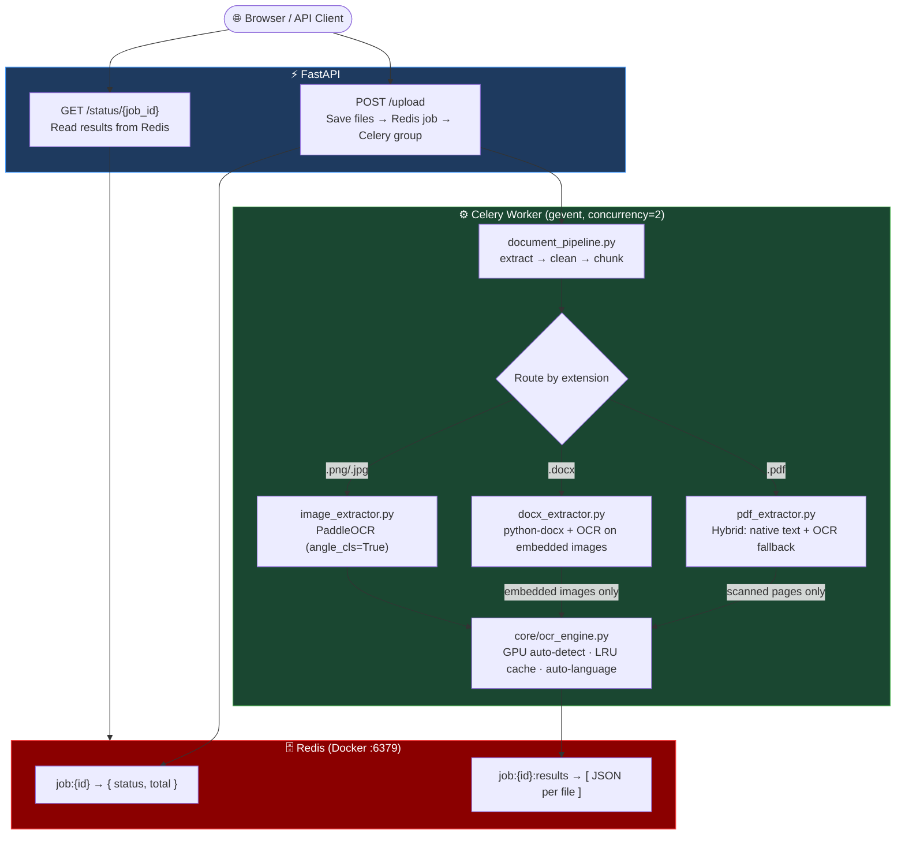
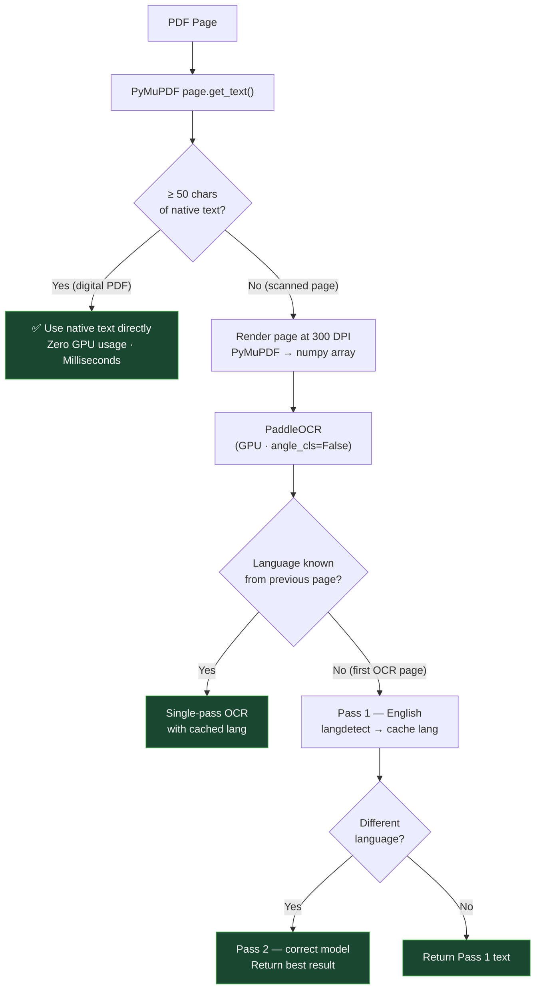
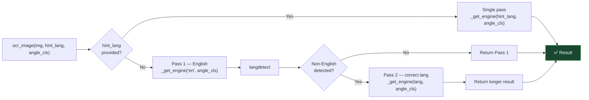
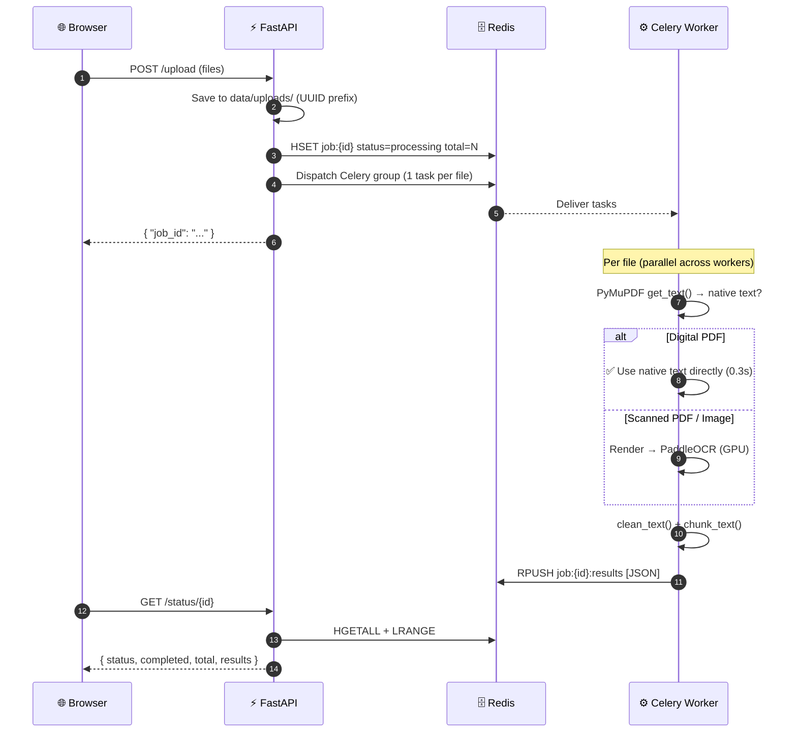

# 📄 OCR Document Processing Pipeline

A high-performance, asynchronous document OCR pipeline built with **FastAPI**, **Celery**, **Redis**, and **PaddleOCR**. Upload PDF, DOCX, or image files and get extracted, cleaned, and chunked text back — processed in parallel in the background with automatic **GPU acceleration** and **multi-language detection**.

> **⚠️ GitHub users**: `data/` and `CUAD_v1/` are excluded via `.gitignore`. The app creates `data/uploads/` on first run. The CUAD dataset must be downloaded via the notebook as described below.

---

## ⚡ Performance Results

After migrating from Tesseract OCR to PaddleOCR with hybrid native text extraction:

| Metric | Before (Tesseract) | After (PaddleOCR + Hybrid) |
|---|---|---|
| Digital PDF processing | 60–120 seconds | **0.28–0.35 seconds** |
| Scanned PDF processing | 60–120 seconds | GPU-accelerated (seconds) |
| VRAM spike during processing | 14–15 GB | **< 1 GB** (no spike for digital PDFs) |
| Multi-language support | Manual config | Auto-detected |
| DOCX embedded images | Not extracted | PaddleOCR via embedded image OCR |

**Key insight**: Most contract PDFs (CUAD dataset) are digital PDFs with embedded text. The hybrid strategy extracts native text in milliseconds with zero GPU usage, reserving OCR only for genuinely scanned pages.

---

## 🏗️ Tech Stack

| Layer | Technology |
|---|---|
| API Server | FastAPI |
| Task Queue | Celery (gevent pool) |
| Message Broker & Result Backend | Redis (via Docker) |
| PDF Text Extraction | PyMuPDF (`fitz`) — native text first, OCR fallback |
| OCR Engine | PaddleOCR (PP-OCRv4 neural network models) |
| GPU Acceleration | PaddlePaddle-GPU (CUDA 11.8/12.x + cuDNN 8.x) |
| DOCX Parsing | python-docx (native) + PaddleOCR (embedded images) |
| Language Detection | langdetect (2-pass auto-detection) |
| Image Processing | Pillow + NumPy |
| Python Version Manager | pyenv |
| Package Manager | uv |

---

## ⚙️ Prerequisites

These must be installed **before** setting up the Python environment.

### 1. Docker Desktop
Used to run Redis in a container.
- Download: [https://www.docker.com/products/docker-desktop](https://www.docker.com/products/docker-desktop)

### 2. pyenv (Windows)
```powershell
Invoke-WebRequest -UseBasicParsing -Uri "https://raw.githubusercontent.com/pyenv-win/pyenv-win/master/pyenv-win/install-pyenv-win.ps1" -OutFile "./install-pyenv-win.ps1"; &"./install-pyenv-win.ps1"
```
> Restart terminal after install.

### 3. uv (Package Manager)
```powershell
powershell -ExecutionPolicy ByPass -c "irm https://astral.sh/uv/install.ps1 | iex"
```
> Restart terminal after install.

### 4. GPU Setup (Optional — NVIDIA GPUs only)

> Skip this section if you have no NVIDIA GPU. The pipeline falls back to CPU automatically.

**Check your GPU**: Run `nvidia-smi`. If you see your GPU listed, proceed.

> **Important**: `nvidia-smi` showing "CUDA Version: X" means your *driver* supports CUDA — the Toolkit must be installed separately.

#### Step A — CUDA Toolkit 12.3
1. Download: [CUDA Toolkit 12.3](https://developer.nvidia.com/cuda-12-3-2-download-archive?target_os=Windows&target_arch=x86_64&target_version=11&target_type=exe_local)
2. Run the installer → choose **Express**.
3. Verify in a new terminal: `nvcc --version`

#### Step B — cuDNN 8.9.7
1. Download: [NVIDIA cuDNN Archive](https://developer.nvidia.com/rdp/cudnn-archive) → cuDNN v8.9.7 for CUDA 12.x → Windows Zip
2. Extract the zip and copy its contents into CUDA (run PowerShell **as Administrator**):
```powershell
Copy-Item ".\bin\*"     "C:\Program Files\NVIDIA GPU Computing Toolkit\CUDA\v12.3\bin\"     -Force
Copy-Item ".\include\*" "C:\Program Files\NVIDIA GPU Computing Toolkit\CUDA\v12.3\include\" -Force
Copy-Item ".\lib\x64\*" "C:\Program Files\NVIDIA GPU Computing Toolkit\CUDA\v12.3\lib\x64\" -Force
```
3. Open a **new terminal** after copying (existing terminals have stale PATH).
4. Verify: `Test-Path "C:\Program Files\NVIDIA GPU Computing Toolkit\CUDA\v12.3\bin\cudnn_ops_infer64_8.dll"` → should return `True`

---

## 🚀 Setup & Run

### Step 1 — Start Redis
```powershell
docker run -d --name redis-server -p 6379:6379 redis
```
> To restart after reboot: `docker start redis-server`

### Step 2 — Install Python 3.12
```powershell
pyenv install 3.12
pyenv local 3.12
```

### Step 3 — Create Virtual Environment & Install Dependencies
```powershell
uv venv .venv
.venv\Scripts\activate
uv sync
```
> PaddleOCR model files (~500 MB) are downloaded automatically on first document processing and cached at `C:\Users\<you>\.paddleocr\`.

### Step 4 — (Optional) Load CUAD Dataset
Open `load_dataset.ipynb` and run the first cell to download CUAD contracts into `CUAD_v1/`.

### Step 5 — Start Celery Worker
```powershell
uv run celery -A core.celery_app worker --loglevel=info --pool=gevent --concurrency=2
```

> `--concurrency=2` is recommended for GPU mode — prevents multiple tasks from competing for VRAM simultaneously.

On successful start with GPU you will see:
```
W0510 ... gpu_resources.cc: device: 0, cuDNN Version: 8.9.
ppocr WARNING: The first GPU is used for inference by default, GPU ID: 0
celery@hostname ready.
```

### Step 6 — Start FastAPI Server
```powershell
uv run fastapi dev main.py
```
Server: **http://127.0.0.1:8000** | Docs: **http://127.0.0.1:8000/docs**

### Step 7 — Upload & Check Results
1. Go to **http://127.0.0.1:8000** → upload a PDF, DOCX, or image.
2. Receive a `job_id`:
   ```json
   { "job_id": "3f2a1b4c-..." }
   ```
3. Go to **http://127.0.0.1:8000/docs** → `GET /status/{job_id}` → paste ID → Execute.
4. Response:
   ```json
   {
     "status": "completed",
     "completed": 1,
     "total": 1,
     "results": [
       {
         "file": "data/uploads/uuid_filename.pdf",
         "result": {
           "clean_text": "...",
           "chunks": ["...", "..."]
         }
       }
     ]
   }
   ```

---

## 📁 Project Structure

```
week1/
├── main.py                    # FastAPI app entry point
├── pyproject.toml             # Project metadata & dependencies
├── data/uploads/              # Uploaded files (auto-created)
│
├── api/
│   ├── router.py              # Combines all sub-routers
│   ├── upload.py              # POST /upload — save files, dispatch Celery group
│   └── status.py              # GET /status/{job_id} — poll job results from Redis
│
├── core/
│   ├── celery_app.py          # Celery instance and broker config
│   ├── ocr_engine.py          # Shared PaddleOCR engine (GPU detection, LRU cache, auto-language)
│   └── redis_client.py        # Shared Redis client
│
├── ingestion/
│   └── file_manager.py        # Saves uploaded bytes to data/uploads/ with UUID prefix
│
├── tasks/
│   └── pipeline_tasks.py      # Celery task: process_single_file (with auto-retry)
│
├── pipeline/
│   └── document_pipeline.py   # Orchestrates: extract → clean → chunk
│
├── extraction/
│   ├── extractor.py           # Routes by file extension
│   ├── pdf_extractor.py       # Hybrid: native text first, PaddleOCR fallback for scanned pages
│   ├── image_extractor.py     # PNG/JPG → PaddleOCR (angle classifier enabled)
│   └── docx_extractor.py      # python-docx (native text) + PaddleOCR (embedded images)
│
└── processing/
    ├── cleaner.py             # Normalizes whitespace
    └── chunker.py             # Splits into ~500-char sentence-aware chunks
```

---

## 🔄 Architecture & Workflow

### High-Level Architecture



---

### PDF Hybrid Extraction Strategy



---

### OCR Engine Design (`core/ocr_engine.py`)



---

### Request Lifecycle (Sequence)



---

## 🌐 API Reference

### `GET /`
Returns an HTML upload form.

### `POST /upload`
Accepts one or more files and queues processing. Returns `{ "job_id": "..." }`.

### `GET /status/{job_id}`
Returns processing status and results.

```json
{
  "status": "completed",
  "completed": 2,
  "total": 2,
  "results": [
    {
      "file": "data/uploads/uuid_filename.pdf",
      "result": {
        "clean_text": "...",
        "chunks": ["...", "..."]
      }
    }
  ]
}
```

**Status values**: `processing` · `completed` · `not_found`

---

## 💡 GPU Memory Behaviour

PaddlePaddle uses an internal CUDA memory pool. Once allocated, VRAM is **not returned to Windows** until the Celery worker process is killed — this is standard deep learning framework behaviour.

| Worker State | VRAM Usage |
|---|---|
| Started (idle, models loaded) | ~6–8 GB |
| Processing a **digital PDF** | ~6–8 GB (no spike — OCR not called) |
| Processing a **scanned PDF / image** | ~6–8 GB (active inference within pool) |
| Worker process killed | 0 GB |

To reclaim VRAM for other applications, stop the Celery worker (`Ctrl+C`).

---

## ⚠️ Troubleshooting

| Problem | Solution |
|---|---|
| `Could not locate cudnn_ops_infer64_8.dll` | cuDNN files not copied, or open a **new terminal** after copying (old terminals have stale PATH) |
| `nvcc` not recognized | Install CUDA Toolkit 12.3 — `nvidia-smi` showing a CUDA version is not enough |
| `ppocr WARNING: The first GPU is used for inference by default` | Not an error — confirms GPU is active |
| `ModuleNotFoundError: No module named 'setuptools'` | Run `uv sync` |
| `Connection refused` on Redis | Run `docker start redis-server` |
| `FileNotFoundError` on task retry | Old task from a previous session — safe to ignore, submit a new file |
| Models downloading on first run | PaddleOCR downloads ~500 MB once to `C:\Users\<you>\.paddleocr\` — cached forever after |

---

## 📝 Notes

- `data/uploads/` is created automatically on first run.
- Uploaded files are stored permanently — add a cleanup routine for production.
- `.python-version` locks Python 3.12 for this project via pyenv.
- For production: add authentication, rate limiting, file size limits, and persistent storage.
