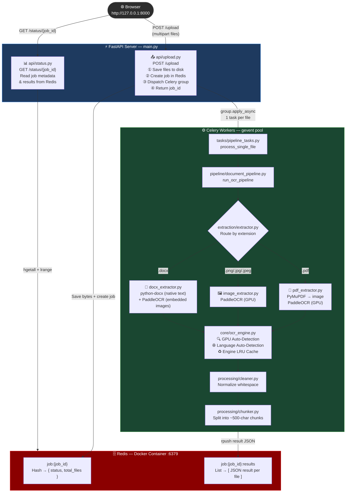
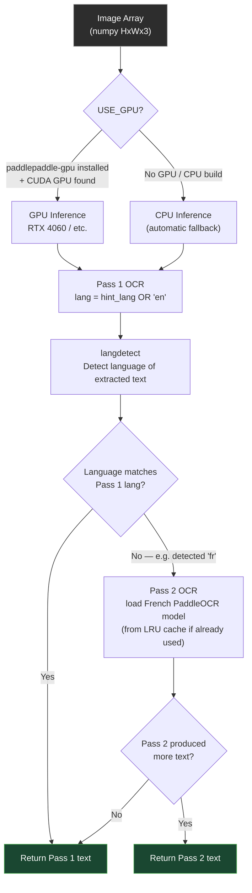
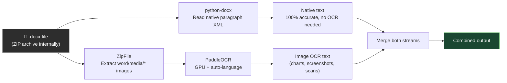
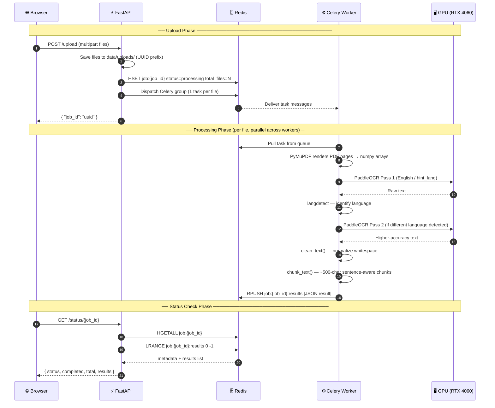

# 📄 OCR Document Processing Pipeline

A high-performance, asynchronous document OCR pipeline built with **FastAPI**, **Celery**, **Redis**, and **PaddleOCR**. Upload PDF, DOCX, or image files and get extracted, cleaned, and chunked text back — all processed in parallel in the background, with automatic **GPU acceleration** and **multi-language auto-detection**.

> **⚠️ Note for GitHub users**: The `data/` and `CUAD_v1/` directories are excluded from this repository via `.gitignore`. You must create `data/uploads/` manually or let the app create it on first run. The CUAD dataset must be downloaded via the notebook as described below.

---

## 🏗️ Tech Stack

| Layer | Technology |
|---|---|
| API Server | FastAPI |
| Task Queue | Celery (gevent pool) |
| Message Broker & Result Backend | Redis (via Docker) |
| OCR Engine | PaddleOCR (PP-OCRv4 neural network models) |
| PDF → Image Rendering | PyMuPDF (`fitz`) — pure Python, no Poppler needed |
| DOCX Parsing | python-docx (native text) + PaddleOCR (embedded images) |
| GPU Acceleration | PaddlePaddle-GPU (CUDA 11.8/12.x + cuDNN 8.x) |
| Language Detection | langdetect (automatic 2-pass language identification) |
| Image Processing | Pillow + NumPy |
| Python Version Manager | pyenv |
| Package Manager | uv |

---

## ⚙️ Prerequisites — System-Level Installations

These must be installed **before** setting up the Python environment.

### 1. Install Docker Desktop

Docker Desktop is used to run the Redis server in a container.

- Download: [https://www.docker.com/products/docker-desktop](https://www.docker.com/products/docker-desktop)
- Install and **start Docker Desktop** before proceeding.

### 2. Install pyenv (Python Version Manager)

pyenv lets you manage multiple Python versions cleanly.

**Windows** — use pyenv-win:
```powershell
Invoke-WebRequest -UseBasicParsing -Uri "https://raw.githubusercontent.com/pyenv-win/pyenv-win/master/pyenv-win/install-pyenv-win.ps1" -OutFile "./install-pyenv-win.ps1"; &"./install-pyenv-win.ps1"
```

> After installation, **restart your terminal** to apply the PATH changes.

### 3. Install uv (Fast Python Package Manager)

`uv` is a blazing-fast pip/virtualenv replacement.

```powershell
powershell -ExecutionPolicy ByPass -c "irm https://astral.sh/uv/install.ps1 | iex"
```

> After installation, **restart your terminal** to apply the PATH changes.

### 4. GPU Setup (Optional but Recommended — for NVIDIA GPUs)

If you have an NVIDIA GPU with CUDA support, follow these steps to enable GPU-accelerated OCR. If you skip this, the pipeline will automatically fall back to CPU.

> **Check if your GPU is NVIDIA**: Run `nvidia-smi` in PowerShell. If you see your GPU listed, proceed.

#### Step A — Install the CUDA Toolkit 12.3

The CUDA Toolkit provides the compiler and libraries needed for GPU computation. Note: `nvidia-smi` showing "CUDA Version: X" only means your driver *supports* that version — the Toolkit must be installed separately.

1. Download from: **[CUDA Toolkit 12.3 Download](https://developer.nvidia.com/cuda-12-3-2-download-archive?target_os=Windows&target_arch=x86_64&target_version=11&target_type=exe_local)**
2. Run the installer and choose **Express** installation.
3. Verify after install (open a **new terminal**):
   ```powershell
   nvcc --version
   # Expected: Cuda compilation tools, release 12.3, ...
   ```

#### Step B — Install cuDNN 8.9.7

cuDNN is NVIDIA's deep learning library. PaddlePaddle-GPU requires it at runtime.

1. Go to: **[NVIDIA cuDNN Archive](https://developer.nvidia.com/rdp/cudnn-archive)** *(free NVIDIA account required)*
2. Click **"Download cuDNN v8.9.7 (December 5th, 2023), for CUDA 12.x"**
3. Select: **"Local Installer for Windows (Zip)"** and download it.
4. Extract the zip file. You will see three folders: `bin`, `include`, `lib`.
5. Open PowerShell **as Administrator** and copy the files into your CUDA installation:

```powershell
# Adjust v12.3 to match your CUDA version if different
Copy-Item ".\bin\*"     "C:\Program Files\NVIDIA GPU Computing Toolkit\CUDA\v12.3\bin\"     -Force
Copy-Item ".\include\*" "C:\Program Files\NVIDIA GPU Computing Toolkit\CUDA\v12.3\include\" -Force
Copy-Item ".\lib\x64\*" "C:\Program Files\NVIDIA GPU Computing Toolkit\CUDA\v12.3\lib\x64\" -Force
```

6. **Open a brand new terminal** after copying — existing terminals have a stale PATH.

> **Verify**: `Test-Path "C:\Program Files\NVIDIA GPU Computing Toolkit\CUDA\v12.3\bin\cudnn_ops_infer64_8.dll"` should return `True`.

---

## 🚀 Setup & Run Guide (Step by Step)

### Step 1 — Start Redis via Docker

```powershell
docker run -d --name redis-server -p 6379:6379 redis
```

> To restart Redis after a system reboot:
> ```powershell
> docker start redis-server
> ```

---

### Step 2 — Verify Tool Installations

```powershell
pyenv --version
uv --version
```

Both commands should return version numbers without errors.

---

### Step 3 — Install Python 3.12

```powershell
pyenv install 3.12
pyenv local 3.12
python --version   # Expected: Python 3.12.x
```

---

### Step 4 — Create and Activate the Virtual Environment

```powershell
uv venv .venv
.venv\Scripts\activate   # Your prompt should now show (.venv)
```

> You must activate `.venv` in **every new terminal** you open for this project.

---

### Step 5 — Install All Dependencies

```powershell
uv sync
```

This reads `pyproject.toml` and installs all dependencies — including PaddleOCR and PaddlePaddle-GPU — into `.venv`.

> PaddleOCR model files (~500 MB) are **not installed here**. They are downloaded automatically from NVIDIA's CDN the first time you process a document, and cached at `C:\Users\<you>\.paddleocr\` for all future runs.

---

### Step 6 — (Optional) Load the CUAD Dataset

If you want to use the **CUAD contract understanding dataset** for testing:

1. Open `load_dataset.ipynb` in VS Code or Jupyter
2. Run only the first cell — it downloads the dataset into `CUAD_v1/`

> This step is optional. You can test with any PDF, DOCX, or image file you have.

---

### Step 7 — Start the Celery Worker

Open a terminal in the project root (with `.venv` activated):

```powershell
uv run celery -A core.celery_app worker --loglevel=info --pool=gevent --concurrency=2
```

You should see the worker connect to Redis and report ready. If GPU is configured correctly, you will also see:

```
W0510 ... gpu_resources.cc: device: 0, GPU Compute Capability: 8.9
W0510 ... gpu_resources.cc: device: 0, cuDNN Version: 8.9.
ppocr WARNING: The first GPU is used for inference by default, GPU ID: 0
```

> **`--concurrency=2`** is recommended for GPU mode. PaddleOCR loads ~500MB model weights per engine. Setting concurrency too high causes multiple models to compete for VRAM simultaneously. For CPU-only mode, you can increase this to `--concurrency=8`.

---

### Step 8 — Start the FastAPI Server

Open a **new terminal** (activate `.venv` again):

```powershell
uv run fastapi dev main.py
```

Server starts at: **http://127.0.0.1:8000** | Docs at: **http://127.0.0.1:8000/docs**

---

### Step 9 — Upload a Document and Get Results

1. Go to **http://127.0.0.1:8000** → select a PDF, DOCX, or image → click **Upload**
2. You receive a `job_id`:
   ```json
   { "job_id": "3f2a1b4c-..." }
   ```
3. Go to **http://127.0.0.1:8000/docs** → `GET /status/{job_id}` → paste the ID → Execute
4. Response:
   ```json
   {
     "status": "completed",
     "completed": 1,
     "total": 1,
     "results": [
       {
         "file": "data/uploads/uuid_filename.pdf",
         "result": {
           "clean_text": "Full extracted and cleaned text...",
           "chunks": ["Chunk 1...", "Chunk 2..."]
         }
       }
     ]
   }
   ```

---

## 📁 Project Structure

```
week1/
├── main.py                   # FastAPI app entry point
├── pyproject.toml            # Project metadata & dependencies
├── data/
│   └── uploads/              # Uploaded files are saved here (auto-created)
│
├── api/                      # HTTP API layer
│   ├── router.py             # Combines all sub-routers
│   ├── upload.py             # POST /upload — file ingestion & job dispatch
│   └── status.py             # GET /status/{job_id} — job status polling
│
├── core/                     # Infrastructure / shared services
│   ├── celery_app.py         # Celery instance and broker config
│   ├── ocr_engine.py         # Shared PaddleOCR engine (GPU detection, lang detection, caching)
│   └── redis_client.py       # Shared Redis client (decode_responses=True)
│
├── ingestion/
│   └── file_manager.py       # Saves uploaded bytes to data/uploads/
│
├── tasks/
│   └── pipeline_tasks.py     # Celery task: process_single_file
│
├── pipeline/
│   └── document_pipeline.py  # Orchestrates extract → clean → chunk
│
├── extraction/               # Format-specific text extractors
│   ├── extractor.py          # Router: dispatches by file extension
│   ├── pdf_extractor.py      # PDF → PyMuPDF renders pages → PaddleOCR
│   ├── image_extractor.py    # PNG/JPG → PaddleOCR directly
│   └── docx_extractor.py     # DOCX: python-docx (native text) + PaddleOCR (embedded images)
│
└── processing/               # Post-extraction text processing
    ├── cleaner.py            # Normalizes whitespace
    └── chunker.py            # Splits text into ~500-char sentence-aware chunks
```

---

## 🔄 Architecture & Workflow

### High-Level Architecture



---

### OCR Engine — How It Works (`core/ocr_engine.py`)



---

### DOCX Hybrid Extraction Strategy



---

### Full Request Lifecycle (Sequence)



---

## 🌐 API Reference

### `GET /`
Returns an HTML upload form.

**Response**: HTML page

---

### `POST /upload`
Accepts one or more files and queues OCR processing.

**Request**: `files` — one or more PDF / DOCX / PNG / JPG files (multipart/form-data)

**Response**:
```json
{ "job_id": "3f2a1b4c-d5e6-..." }
```

---

### `GET /status/{job_id}`
Returns the processing status and results for a given job.

**Response**:
```json
{
  "status": "completed",
  "completed": 2,
  "total": 2,
  "results": [
    {
      "file": "data/uploads/uuid_filename.pdf",
      "result": {
        "clean_text": "Full extracted and cleaned text...",
        "chunks": ["Chunk 1 text...", "Chunk 2 text..."]
      }
    }
  ]
}
```

**Status values**:
- `processing` — still running
- `completed` — all files done
- `not_found` — invalid `job_id`

---

## 💡 GPU Memory Behaviour

PaddlePaddle uses an internal memory pool. Once it allocates VRAM, it **does not return it to Windows** until the Celery worker process is completely killed — even after `paddle.device.cuda.empty_cache()` is called. This is by design in all major deep learning frameworks.

| State | Dedicated VRAM Used | Reason |
|---|---|---|
| Celery worker started (idle) | ~6–8 GB | PaddlePaddle pre-allocates a large memory pool on startup |
| Processing a document | ~6–8 GB | Active inference runs inside the already-allocated pool |
| Task completed, worker still running | ~6–8 GB | Pool is retained — memory is NOT released back to Windows |
| Celery worker process killed | 0 GB | OS reclaims all VRAM immediately |

**This is expected and not a bug.** The trade-off is: VRAM stays reserved so every subsequent request runs instantly without any re-allocation overhead. If you need the VRAM back for other applications, simply stop the Celery worker.


---

## 🔧 Celery Configuration Notes

| Setting | Value | Reason |
|---|---|---|
| `--pool=gevent` | async I/O | Enables non-blocking I/O across all workers |
| `--concurrency=2` | 2 parallel tasks | Recommended for GPU — prevents multiple 500MB models from fighting over VRAM |
| `--concurrency=8` | 8 parallel tasks | Use only in CPU mode |
| `task_time_limit=3600` | 1 hour hard kill | Safety guard for runaway tasks |
| `task_soft_time_limit=3300` | 55 min warning | Raises `SoftTimeLimitExceeded` before hard kill |

---

## ⚠️ Troubleshooting

| Problem | Solution |
|---|---|
| `Could not locate cudnn_ops_infer64_8.dll` | cuDNN 8.x files were not copied into CUDA directory, or you need to **open a new terminal** after copying (old terminals have stale PATH) |
| `ModuleNotFoundError: No module named 'setuptools'` | Run `uv sync` — setuptools is now a declared dependency |
| `nvcc is not recognized` | CUDA Toolkit is not installed. Install CUDA Toolkit 12.3 from the NVIDIA website |
| `ppocr WARNING: The first GPU is used for inference by default` | This is **not an error** — it means GPU is active and being used |
| `Connection refused` on Redis | Start Redis: `docker start redis-server` |
| Celery worker not picking up tasks | Ensure `-A core.celery_app` is specified and Redis is running |
| `FileNotFoundError` on old task retry | A task from a previous session tried to reprocess a deleted file. It is safe to ignore — submit a new file |
| Models downloading slowly on first run | PaddleOCR downloads ~500 MB of model weights on first use. They are cached at `C:\Users\<you>\.paddleocr\` and never downloaded again |
| `ModuleNotFoundError` after adding new dependency | Run `uv sync` to sync the environment with `pyproject.toml` |

---

## 📝 Notes

- The `data/uploads/` directory is created automatically on first run.
- Uploaded files are stored permanently — add a cleanup routine if needed for production.
- PaddleOCR model files are cached at `C:\Users\<you>\.paddleocr\` after first download.
- For production use, consider adding authentication, rate limiting, and persistent storage.
- The `.python-version` file locks Python 3.12 for this project via pyenv.
